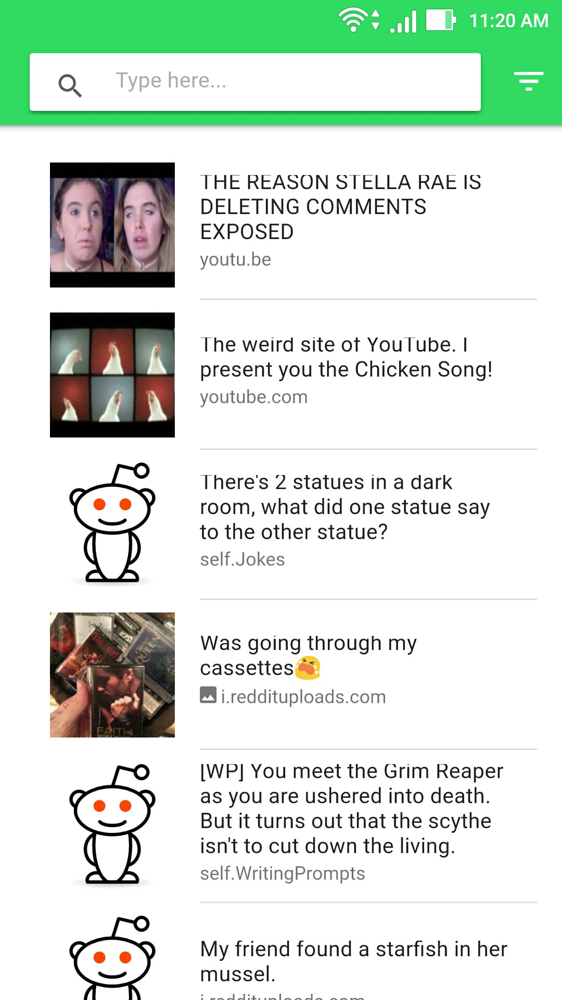
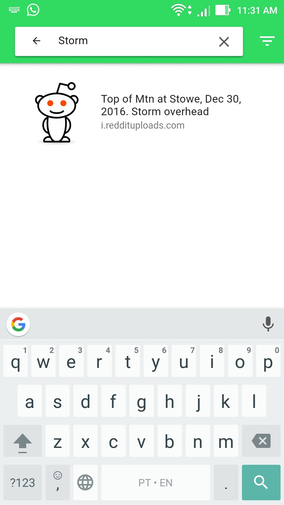

# IONIC app example

This project is based on a tutorial by Carlos Cabral - https://tableless.com.br/criando-uma-aplicacao-movel-com-ionic-2-e-angular-2-em-dez-passos/ 

The application starts loading information consumed from the Reddit API and showing the results in a list.

    

The users have the option to search by predefined filters.

    

Also, they can search by the search bar.

    

The app has a listview with rendering control.


Ionic information


Install Ionic
```
  npm install -g ionic cordova
```

Run on IOS divise
```
  ionic platform add ios
  
  npm -g install ios-sim ios-deploy
  
  ionic run ios 
```

Run on Android divise
```
  ionic platform add android
  
  ionic run android
```


